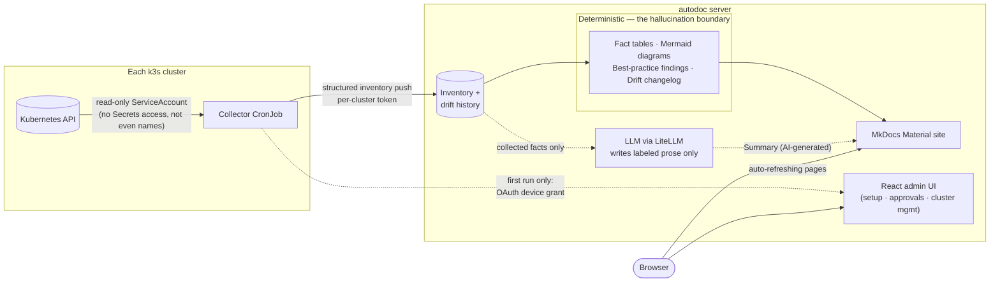

# homelab-autodoc

Living documentation for Kubernetes homelabs. A lightweight, read-only collector inspects the real state of one or more k3s clusters and pushes a structured inventory to a central server, which turns it into a searchable, wiki-style documentation site — fact tables, topology diagrams, best-practice findings, and a changelog of what actually changed.

Docs that can't go stale, because they're regenerated from the cluster itself, not written by hand — and that tell you when they *are* stale, because every cluster card shows when its data was last collected.

## Why

Most cluster documentation rots the moment someone edits a Deployment by hand. homelab-autodoc closes that gap by drawing a hard line between facts and prose:

- **Facts** (image tags, replicas, ports, ingress hosts, volumes, service relationships, policies, events) come **deterministically** from a read-only Kubernetes inventory — never from an LLM.
- An **LLM** only writes the clearly labeled prose summaries on top of those facts.
- Every diagram and every finding is templated from the same inventory data, not generated by the LLM.

This keeps the hallucination surface small and auditable: if a fact is wrong, it's a collector bug, not a model guess.

## How it works

Solid arrows are deterministic and reproducible from the same inventory; dashed arrows are the only paths an LLM touches — its prompts contain nothing but collected facts, its output is always labeled, and the fact tables render in full alongside it.

## What the generated site shows

- **Start page** — a small fleet dashboard: one card per cluster with namespaces/apps/nodes, the kubelet version (versions, when nodes disagree), findings count, last-run drift, and a live "collected 3 h ago" stamp that flags itself stale when the collector stops pushing.
- **Per app** — fact tables (containers incl. init containers, probes, security context, services and routes, volumes, scheduling constraints, resources, autoscaling, rollout strategy, disruption budget, environment variables without values, ConfigMap/Secret dependencies, image registries and pull secrets, nodes), a deterministic topology diagram with pan/zoom, a GitOps provenance badge (Flux Kustomization / HelmRelease / Helm release, read from the markers those tools set), best-practice findings, and an optional AI summary.
- **Per namespace** — app cards with readiness dots, a namespace topology diagram, reverse dependency usage (which app uses which ConfigMap/Secret), resource governance (quotas, limit ranges), and the most recent Warning events: what's unhealthy right now, next to what should be running.
- **Per cluster** — topology, an aggregated findings page (floating image tags, missing probes or resource limits, root-capable containers, workloads without a NetworkPolicy, dangling and orphaned ConfigMaps, missing PodDisruptionBudgets, ...), a deduplicated image list with "used by", storage classes, nodes, and a changelog that opens with an AI-written summary of recent drift — above the full deterministic entries.
- **About page** — the one written page, explaining the pipeline and the hallucination boundary to visitors.
- Every page polls the server's build stamp and reloads itself when a new build lands — no manual refresh after a collector run.

## Components

| Component | Stack | Responsibility |
|---|---|---|
| [core/](core/) | Plain Python dataclasses | The shared inventory model and its JSON/YAML serialization — the contract between collector and server, with no Kubernetes or LLM dependency. Also home of the snapshot diff that powers drift detection. |
| [collector/](collector/) | Python CLI, `kubernetes` client, read-only ServiceAccount | Inventories Deployments, StatefulSets, DaemonSets and CronJobs via a per-kind adapter registry, and associates Services, Ingress + Gateway-API HTTPRoutes, volumes, HPAs, NetworkPolicies, ServiceAccounts/RoleBindings, PDBs, quotas, node placement, ConfigMap names and Warning events with them. Deliberately has **no Secrets access — not even names**. Registers itself once via OAuth device grant, caches its push token, and pushes on a nightly CronJob. |
| [generator/](generator/) | Jinja2 templates + [LiteLLM](https://docs.litellm.ai/) (Ollama, OpenAI, Anthropic, ...) | Inventory → Markdown. Fact tables, Mermaid diagrams, best-practice findings, drift changelog and navigation are deterministic; LiteLLM makes the prose provider a config value, not an adapter class. |
| [server/](server/) | FastAPI (thin web layer over a framework-free logic package), MkDocs Material | Receives pushes, stores inventory + drift history, rebuilds and serves the static site, exposes the build stamp the auto-refresh script polls, and hosts the admin app. Aggregates multiple clusters into one site. |
| [frontend/](frontend/) | React + TypeScript + Vite | The admin app at `/admin`: first-run setup wizard (GitHub OAuth2 or self-hosted OIDC), device-grant approvals, and registered-cluster management incl. deletion — full-screen, provider-aware login button, lists that live-update. |
| [k8s/](k8s/) | Manifests + Flux wiring | Everything running in production: nightly collector CronJob, server Deployment (zero-downtime rolling updates guarded by a startup probe), HTTPRoute, NetworkPolicies, least-privilege RBAC. Flux image automation rolls out new server releases without a manual `kubectl apply`. |

## Deployment

CI builds multi-arch (amd64/arm64) Docker images for collector and server on native runners per architecture and publishes them to GHCR on every release (semantic-release). The server is Flux-managed end to end: a new release tag is detected, committed back to [`k8s/01-app.yaml`](k8s/01-app.yaml) and rolled out automatically with zero downtime — the old pod keeps serving until the new one has finished its startup rebuild. The collector CronJob and the surrounding bootstrap resources (RBAC, NetworkPolicies, HTTPRoute) are applied by hand — see [k8s/README.md](k8s/README.md) for the full bootstrap and operations guide.

## Status

All planned milestones are done: S1 collector, S2 generator, S3 server-hosted site, S3.5 auth (device grant + pluggable admin login + setup wizard), S4 drift detection — plus a content round on top: best-practice findings, fleet dashboard cards with live freshness, a cluster-wide image list, per-namespace Warning events, GitOps provenance badges, AI drift summaries and the About page. S5 (Home Assistant / HACS as an additional inventory source) is optional and not started. See each package's README for usage.

## License

MIT — see [LICENSE](LICENSE).
